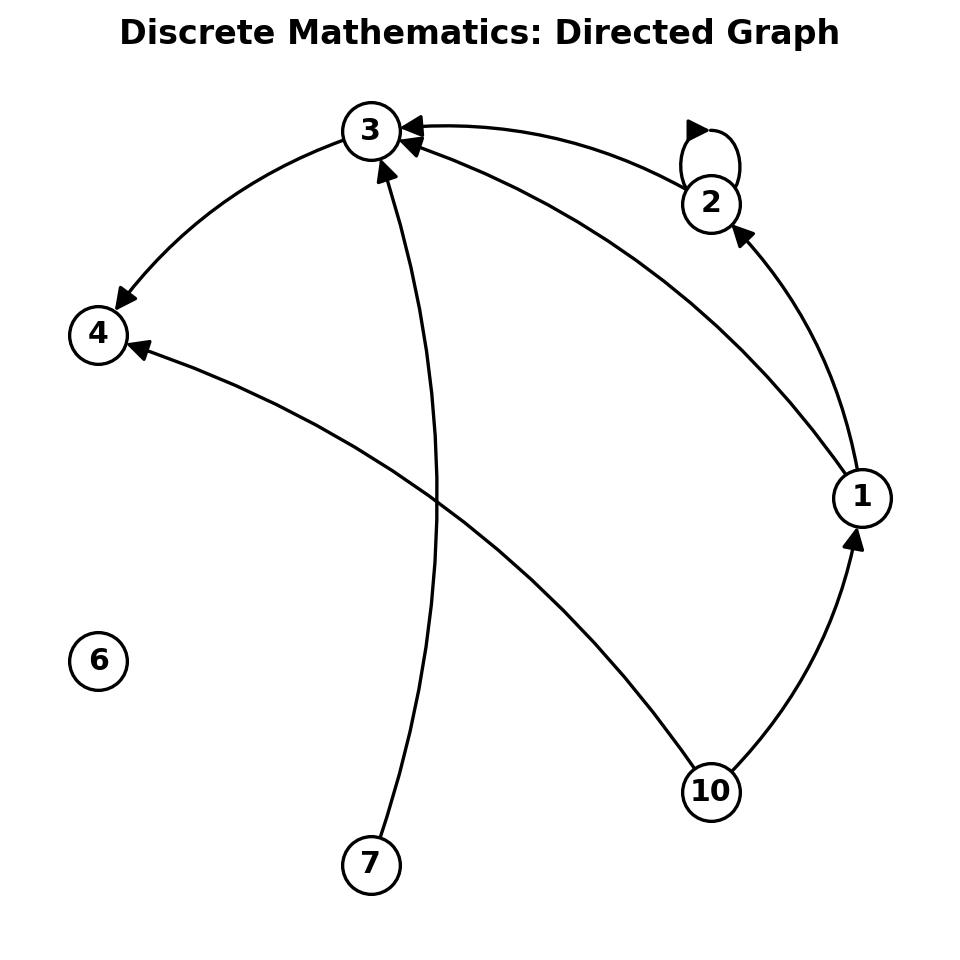

# Directed Graph Generator

Directed Graph Generator is a Python library for creating and analyzing directed graphs commonly used in discrete mathematics and graph theory.

## Features

- Create directed graphs programmatically
- Visualize nodes and directed connections
- Analyze graph properties (connectivity, circuits, trails)
- Check for strong/weak connectivity
- Determine Eulerian circuits and trails
- Add/remove nodes and connections dynamically
- Export graphs as visual diagrams

## Installation

```bash
pip install directed-graph-generator
```

Or install from source:
```bash
git clone https://github.com/ayushpatwari/Directed-Graph-Generator.git
cd Directed-Graph-Generator
pip install -r requirements.txt
```

## Usage

### Basic Usage

```python
from directed_graph_generator import DirectedGraph

# Create a directed graph with nodes and connections
nodes = [1, 2, 3, 4]
connections = [(1, 2), (2, 3), (3, 4), (4, 1)]

graph = DirectedGraph(nodes, connections)

# Generate and display the graph
graph.generate_graph()

# Analyze graph properties
print(f"Graph degree: {graph.degree()}")
print(f"Is connected: {graph.isConnected()}")
print(f"Connectivity type: {graph.connectivenessType()}")
print(f"Is Eulerian circuit: {graph.isEuclideanCircuit()}")
print(f"Is Eulerian trail: {graph.isEuclideanTrail()}")
```

### Adding Nodes and Connections

```python
# Add a new node
graph.add_node(5)

# Add a new connection
graph.add_connection(1, 5)

# Remove a node (and all its connections)
graph.remove_node(3)

# Remove a specific connection
graph.remove_connection(1, 2)
```

## Graph Analysis Features

### Connectivity Analysis
- **Strongly Connected**: Every node can reach every other node
- **Weakly Connected**: The underlying undirected graph is connected
- **Not Connected**: The graph has disconnected components

### Eulerian Properties
- **Eulerian Circuit**: A circuit that visits every edge exactly once
- **Eulerian Trail**: A trail that visits every edge exactly once

### Graph Properties
- **Degree**: Total number of connections in the graph
- **Node Management**: Add, remove, and modify nodes
- **Connection Management**: Add, remove, and modify connections

## Example Output



## API Reference

### DirectedGraph Class

The main class for creating and manipulating directed graphs.

#### Constructor
```python
DirectedGraph(nodes: List[int], connections: List[tuple[int, int]])
```

#### Methods

- `generate_graph()`: Displays the graph visualization
- `degree()`: Returns the total degree of the graph
- `isConnected()`: Checks if the graph is connected
- `connectivenessType()`: Returns connectivity type ("strong", "weak", or "None")
- `isStronlyConnected()`: Checks for strong connectivity
- `isWeaklyConnected()`: Checks for weak connectivity
- `isEuclideanCircuit()`: Checks if graph is an Eulerian circuit
- `isEuclideanTrail()`: Checks if graph is an Eulerian trail
- `add_node(value)`: Adds a new node
- `add_connection(start, end)`: Adds a new connection
- `remove_node(value)`: Removes a node and its connections
- `remove_connection(start, end)`: Removes a specific connection

## Requirements

- Python 3.9+
- matplotlib
- networkx
- numpy

## Contributing

Contributions are welcome! Please open issues or submit pull requests.

## License

This project is licensed under the MIT License.